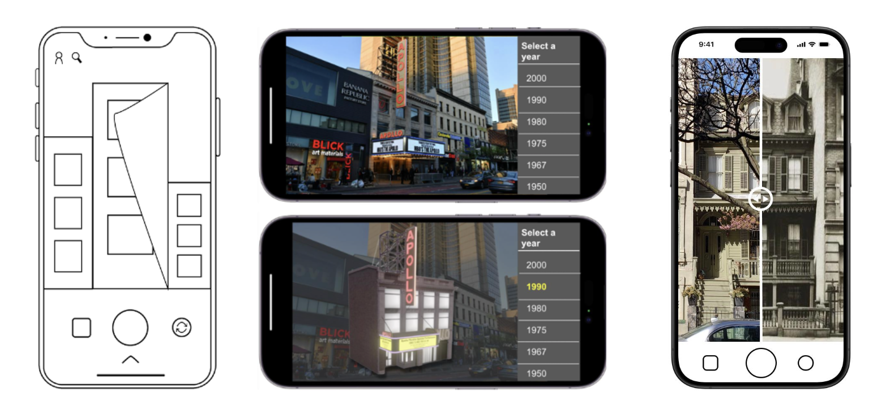
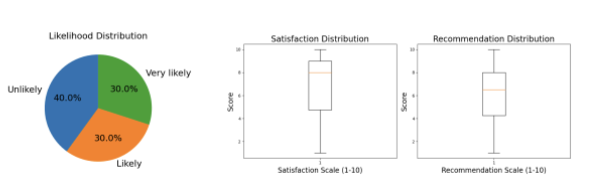

## Table of Contents

1. [Overview](#overview)
2. [Tech Stack](#tech-stack)
3. [Responsibilities](#responsibilities)
4. [Key Features](#key-features)
5. [Future Scope](#future-scope)
6. [Applications](#applications)
7. [Links](#links)

---

## Overview

**Community History Through AR** is an Augmented Reality application developed to preserve and celebrate the cultural and historical identity of Harlem, New York. As the neighborhood faces ongoing gentrification, this platform empowers local residents to reconnect with their roots by engaging with AR-enhanced narratives tied to landmarks, buildings, and shared community stories.

Inspired by features from previous projects like *Emoverse*, the app allows users to leave behind digital memories  AR assets, comments, and stories  at real-world locations. These contributions create a living, community-driven archive that fosters emotional connection and cultural continuity.

---

## Tech Stack

- **Programming Languages:** Python  
- **Libraries:** Unity, Blender, Figma  
- **Tools:** Adobe Illustrator, Balsamiq

The development process involved **Unity** and **Blender** for prototyping 3D models and interactive AR scenes, while **Figma** and **Balsamiq** were used for designing wireframes and refining user interaction flows. Supporting visuals were developed in **Adobe Illustrator**, ensuring a consistent and accessible UI. The use of Python scripts further supported backend logic and data handling in testing phases.

---

## Responsibilities

The project began with **community research**, including field interviews, archival exploration, and collaboration with key stakeholders such as the **NSF Center for Smart Streetscapes (CS3)** and the **125th Street Business Improvement District**. This ensured that the application design aligned with community needs and historical integrity.

In terms of **UI/UX design**, I created multi-layered wireframes in Figma, incorporating interactive elements like **heatmaps** (inspired by Snapchat) to highlight Harlem’s key landmarks and storytelling locations. These were themed around local history, safety, health, and art.

On the technical side, I developed AR features using Unity. This included 3D modeling of historic buildings in Blender to enable time-based visualization, allowing users to view how a site looked in the past versus today. I also integrated features that allowed users to place and view **location-bound AR content**, further enriched by community input.

To validate our concept, a **pilot study** was conducted with 10 participants using a beta version of the app. Feedback from this study was used to iterate on core design and functionality.

---

## Key Features

One of the central features is the **heatmap functionality**, which visualizes historical engagement across Harlem  drawing attention to important cultural and architectural points.

The app also includes **AR storytelling capabilities**, where users can point their phones at buildings or landmarks and see overlays of historical photos, events, and community-submitted narratives.

To further immerse users, **interactive maps** were built that highlight stories under key community themes, including public safety, health, and local art initiatives. These maps adapt in real time as users contribute new content or explore different parts of the neighborhood.

---

## Future Scope

As the project evolves, several directions for future development have been identified:

- **Enhanced User Experience:** Refining navigation and UI interactions to make the platform more intuitive and accessible across devices.
- **User Studies:** Conducting expanded studies with Harlem residents to validate and scale the platform, ensuring it remains grounded in authentic community needs.
- **Research Publication:** Documenting findings and methodologies to publish a paper on the intersection of AR and cultural preservation, contributing to research in community-based design and immersive technology.

---

## Applications

This project has broad interdisciplinary applications:

- In **cultural preservation**, it provides communities with tools to reclaim and protect their narratives.
- As an **educational resource**, it introduces immersive ways for students and institutions to engage with local history.
- For **civic engagement**, it encourages shared storytelling that can strengthen neighborhood identity and social cohesion.

---

## Links

- [Explore Community History Through AR Features](https://yourdomain.com/ar-harlem-app)  
- [Research Paper on AR and Cultural Preservation](https://yourdomain.com/ar-harlem-research)

---
