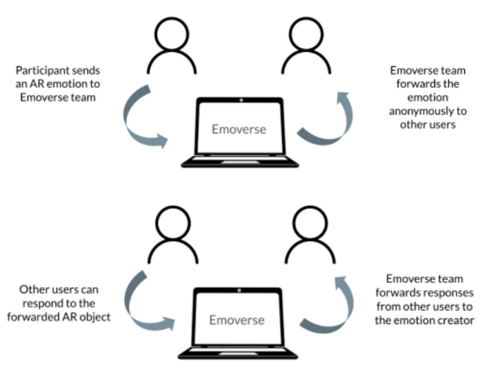
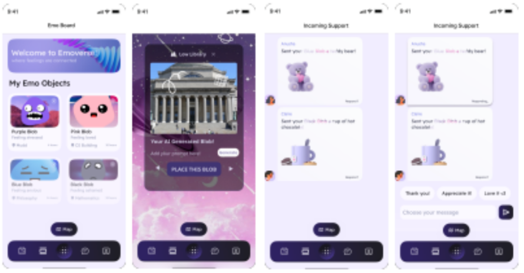
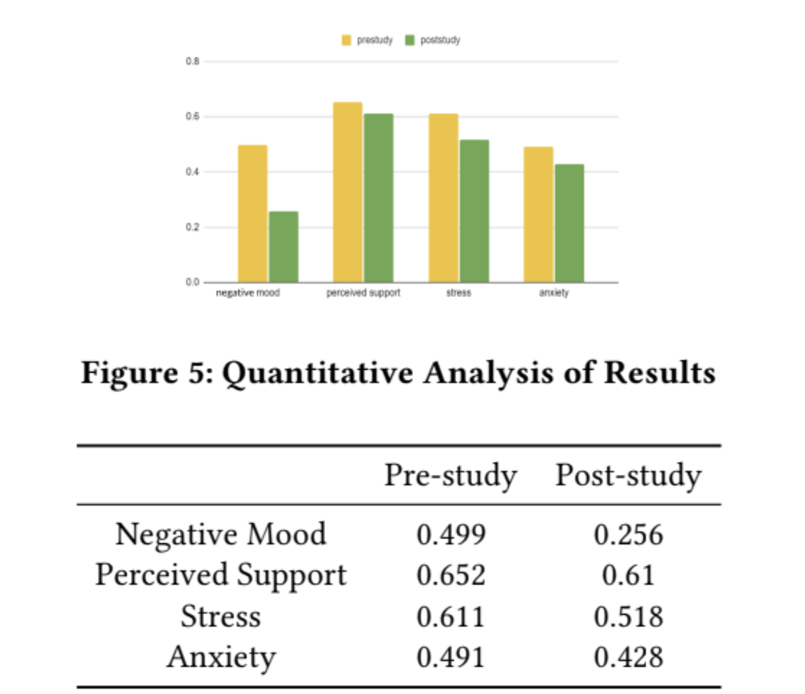

## Table of Contents

1. [Overview](#overview)
2. [Tech Stack](#tech-stack)
3. [Key Features](#key-features)
4. [Project Highlights](#project-highlights)
5. [Applications](#applications)
6. [Impact](#impact)
7. [Future Scope](#future-scope)
8. [Links](#links)

---

## Overview

**Emoverse** is an Augmented Reality (AR) platform built to promote emotional well-being, especially among university students navigating academic stress and personal challenges. The platform encourages users to **externalize their emotions** through AR objects, which are shared in a collaborative virtual environment.

These objects, paired with descriptive text, form the basis for asynchronous and empathetic interaction. Other users can respond to emotional expressions by interacting with AR elements  such as poking, patting, or replying  fostering **community-driven support** without the pressure of real-time conversation.

---

## Tech Stack

- **Platform:** Augmented Reality (AR) using tools like Luma  
- **Prototype Design:** Figma  
- **Backend & Testing:** Email-based Wizard-of-Oz setup for simulation

The system was prototyped using **Figma** to design the interface and user journey, while AR experiences were conceptualized using **Luma**. Early-stage interactions were tested via a **Wizard-of-Oz setup**, where backend logic was simulated through email-based user responses to validate core design hypotheses before full implementation.

---

## Key Features

Emoverse allows users to **create symbolic AR objects** representing emotional states. These are not just static visuals  they come paired with **personal reflections**, enabling contextual understanding and richer emotional communication.

Users engage in a **virtual emotional space**, where they can interact with shared AR content by touching, poking, or patting  translating physical gestures into virtual empathy. Over time, these interactions evolve into **support threads**, capturing a journey of shared emotional experiences.

The system is intentionally asynchronous, which provides users with the flexibility to engage **on their own terms**, promoting deeper, more thoughtful interactions that aren’t limited by time or presence.

---

## Project Highlights

A key success of the project was its **user-centered design**, validated through user studies that showed measurable improvements in mood and emotional state. Participants engaged with the platform and reported reductions in anxiety and stress after emotional expression.

The prototype was iteratively refined in **Figma**, incorporating features like **customizable AR visuals**, **descriptive text prompts**, and a fluid interface for interaction. These elements were tested and validated for usability and emotional resonance.

Emoverse also demonstrated that **emotion sharing through AR**, even without real-time presence, can still create meaningful community support and psychological relief.

---

## Applications

The Emoverse concept can be extended across several domains. In **mental health support**, it facilitates **non-intrusive emotional reflection** and **peer validation**  which are critical for student well-being.

In **therapeutic settings**, it provides a lightweight, expressive tool that can supplement counseling and mindfulness practices. Additionally, it supports **community building** in both academic and broader social contexts, offering a platform for empathy-driven interactions in digital space.

---

## Impact

User studies revealed strong **quantitative outcomes**, including a **50% reduction in negative moods** and a **12% drop in anxiety** within 24 hours of using Emoverse. These outcomes demonstrate the tangible impact of emotional externalization through interactive AR.

Users described the experience as “**heartwarming**,” highlighting the importance of pairing emotional visuals with written context. Feedback underscored how even asynchronous interactions created a sense of **human connection** and comfort.

---

## Future Scope

Future development will explore **real-time interaction capabilities**, such as direct chat and feedback for more immediate emotional support. There’s also potential for **customizable AR emotion objects**, allowing users greater expressive control.

In addition, Emoverse could be expanded through **larger-scale user studies** in therapeutic, academic, and social settings to evaluate its use in long-term emotional well-being and mental health strategies.

---

## Links

- [View Emoverse Prototype on Figma](https://yourdomain.com/emoverse-figma)  
- [Research Paper on Emoverse](https://yourdomain.com/emoverse-paper)

---
