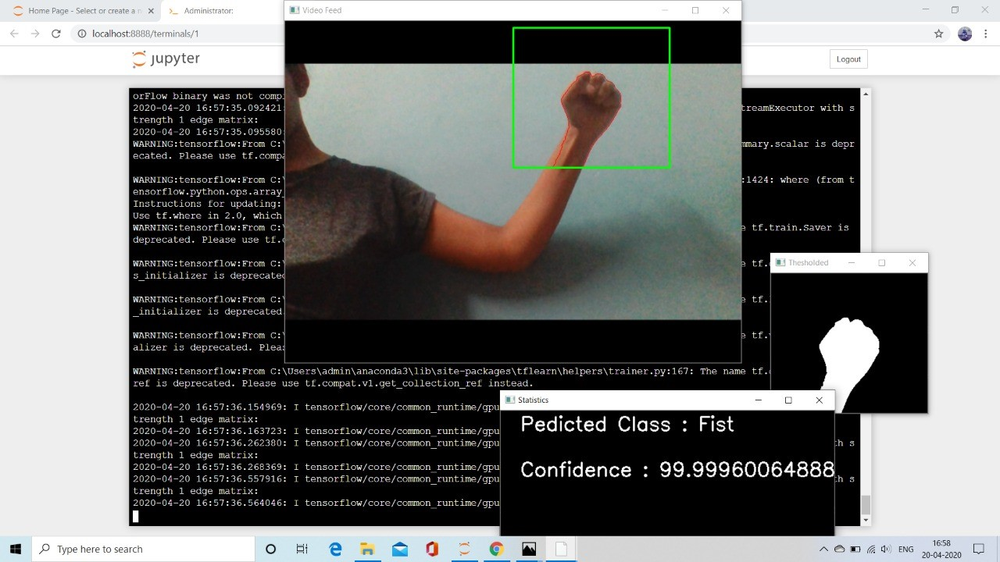

## Table of Contents

1. [Overview](#overview)
2. [Tech Stack](#tech-stack)
3. [Key Features](#key-features)
4. [Project Highlights](#project-highlights)
5. [Outcome](#outcome)
6. [Links](#links)

---

## Overview

The Hand Gesture Recognition System is a machine learning-based solution designed to interpret static hand gestures in real time. The system enhances **human-computer interaction (HCI)** across domains such as smart automation, immersive gaming, and assistive technologies.

The primary goal was to design a model capable of identifying hand gestures under varying lighting, background complexity, and positioning, with high accuracy. The system translates physical hand signs into digital commands, offering an intuitive, touchless way to control devices and software.

---

## Tech Stack

- **Programming Languages:** Python  
- **Libraries and Tools:** OpenCV, TensorFlow, Keras  
- **Dataset:** NUS Hand Posture Dataset

The project was developed using **Python**, taking advantage of **OpenCV** for image processing and camera integration. Deep learning models were built with **TensorFlow** and **Keras** to classify gestures from segmented image inputs. The training and testing were done using the **NUS Hand Posture Dataset**, which provides a comprehensive set of labeled hand gestures captured in diverse environments. This dataset ensured that the model could generalize well to real-world variability.

---

## Key Features

The system leverages robust feature extraction techniques, including **Histogram of Oriented Gradients (HOG)** and **Fibonacci Weighted Neighborhood Patterns (FWNP)**. These helped capture the critical structure of hand shapes and ensured consistent recognition even with subtle posture differences.

A dedicated real-time pipeline was implemented using a standard webcam to detect gestures on the fly. Preprocessing steps like background segmentation, noise filtering, and edge detection were optimized to isolate the hand region with precision.

Performance was enhanced by introducing adaptability in the model, allowing it to function effectively across dynamic environments  including changes in lighting, scale, and gesture angle.

---

## Outcome

The model delivered **high gesture classification accuracy**, maintaining consistent performance under varied conditions. User interaction was found to be fluid and responsive, greatly improving the experience of HCI through hand recognition.

This project demonstrated how a combination of classical image processing and modern neural networks can result in scalable, practical systems with applications in automation, assistive tech, and human-computer collaboration.

---

## Project Highlights

This system unlocks multiple real-world use cases. For instance, it supports **touchless control** of smart home devices, enabling users to operate appliances without physical contact. In **gaming and entertainment**, it can provide immersive control inputs, expanding player interaction without external controllers.

From an accessibility standpoint, the system is capable of assisting in **sign language interpretation**, bridging communication gaps for the hearing-impaired. Additionally, the model’s robustness makes it suitable for **defense applications**, where secure and gesture-based interaction systems are increasingly valuable.

---

## Links

- [GitHub Repository](https://github.com/yourusername/hand-gesture-recognition)  
- [Research Documentation](https://yourdomain.com/hgr-docs)

---
