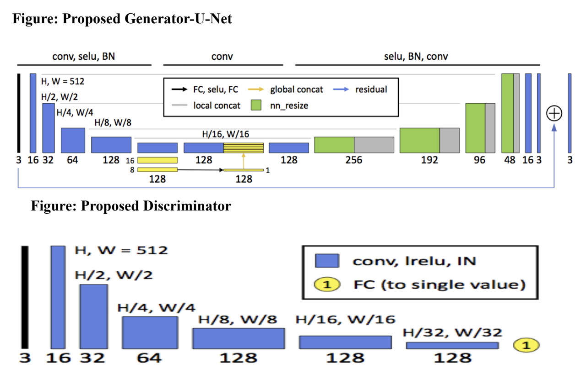

## Table of Contents

1. [Overview](#overview)
2. [Tech Stack](#tech-stack)
3. [Key Features](#key-features)
4. [Project Highlights](#project-highlights)
5. [Applications](#applications)
6. [Outcome](#outcome)
7. [Links](#links)

---

## Overview

This project focuses on **image enhancement using Generative Adversarial Networks (GANs)** to improve the visual quality of low-resolution or noisy images. The GAN architecture was tailored to boost image sharpness, brightness, and contrast  making it suitable for applications where detail clarity is critical.

Challenges related to recovering information from degraded images were addressed by integrating both local and global enhancement mechanisms into the model. The architecture was evaluated on a wide variety of inputs and proved effective in producing visually superior outputs, even under harsh imaging conditions.

---

## Tech Stack

- **Programming Languages:** Python  
- **Libraries:** OpenCV, TensorFlow, Keras  
- **Dataset:** MIT-Adobe 5K (5,000 high-resolution images)

The model was built using **Python** and implemented with **TensorFlow** and **Keras** for deep learning workflows. **OpenCV** was used for image preprocessing and visualization. Training and evaluation were performed on the **MIT-Adobe 5K dataset**, which includes diverse high-resolution photos ideal for enhancement tasks. The dataset’s variability allowed testing under real-world conditions, ensuring robustness across lighting and noise levels.

---

## Key Features

The model leverages a **custom U-Net-based generator**, capable of capturing both fine-grained details and high-level image structure. Global image features are injected into the decoder stages to balance local sharpness with contextual consistency.

To improve training dynamics, a **Wasserstein GAN (WGAN)** variant was employed. This helped achieve faster convergence and better gradient stability. An **adaptive weighting mechanism** was introduced to prioritize difficult samples and dynamically adjust learning focus.

The enhancement process was further refined by **automating critical preprocessing steps** like edge detection, noise reduction, and region-based segmentation  allowing the model to receive clearer, more focused inputs.

---

## Project Highlights

One of the standout accomplishments was the **significant improvement in Peak Signal-to-Noise Ratio (PSNR)** over traditional enhancement baselines. This metric reflects the model’s ability to restore image fidelity and reduce distortion.

The training strategy also incorporated **cycle consistency** using a dual-direction GAN setup. This ensured that enhancements did not introduce visual artifacts and could be reversed with minimal degradation. Additionally, **SSIM (Structural Similarity Index)** was used to evaluate perceptual quality and validate improvements across varying image conditions  including low light, motion blur, and poor exposure.

---

## Applications

This system has real-world applicability across several domains. It can be used for **photo enhancement** in photography platforms and social media pipelines to increase visual appeal with minimal user effort. In **medical imaging**, it can enhance structural visibility in scans, supporting better diagnosis and analysis.

It is also applicable in **underwater photography**, where lighting conditions are often poor and color fidelity is distorted. The architecture is extendable to **real-time video processing**, opening up possibilities in security footage enhancement and media post-production.

---

## Outcome

The project resulted in a **scalable and efficient image enhancement pipeline**, capable of running near real-time on modern hardware. Its modular design and generalizability make it well-suited for adaptation across a wide range of use cases  from everyday photo editing to high-stakes medical and environmental imaging.

In terms of performance, the system consistently delivered cleaner, sharper, and more accurate visual outputs, verified both through quantitative metrics and human evaluation.

---

## Links

- [GitHub Repository](https://github.com/yourusername/image-enhancement-gans)  
- [Research Documentation](https://yourdomain.com/your-doc-link)

---
