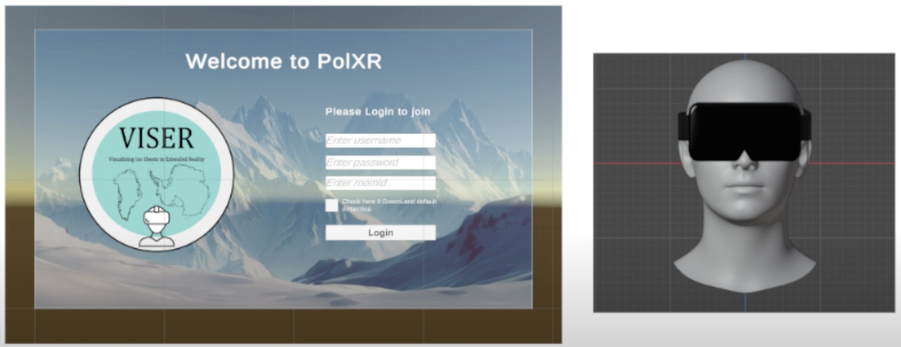
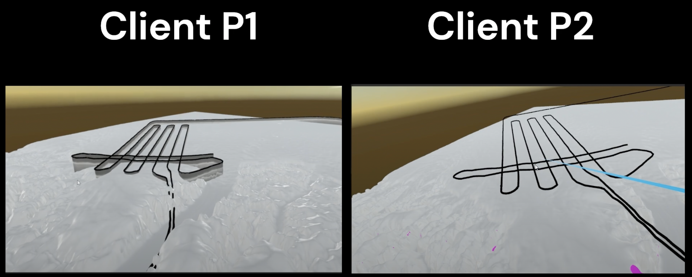

## Table of Contents

1. [Overview](#overview)
2. [Tech Stack](#tech-stack)
3. [Key Features](#key-features)
4. [Project Highlights](#project-highlights)
5. [Applications](#applications)
6. [Future Scope](#future-scope)
7. [Related Links](#related-links)

---

## Video Demo

<iframe width="100%" height="400" src="https://www.youtube-nocookie.com/embed/9MUUbKgprP8?si=WGQXX1OxJ-aPIaKk"
title="YouTube video player" frameborder="0"
allow="accelerometer; autoplay; clipboard-write; encrypted-media; gyroscope; picture-in-picture; web-share"
referrerpolicy="strict-origin-when-cross-origin" allowfullscreen></iframe>

---

## Overview

**PolXR** is an extended reality platform designed to visualize and explore polarimetric geospatial datasets in immersive 3D environments. Developed under Columbia University’s **VISER (Visualization for Enhanced Scientific Exploration in Research)** initiative, the project is intended to support climate and environmental research through more intuitive, interactive data analysis.

By leveraging cutting-edge XR capabilities, PolXR empowers researchers to interact with data in virtual or augmented reality. This allows for deeper pattern recognition, spatial reasoning, and a better grasp of complex environmental datasets. The system is tailored not only for scientific accuracy but also for usability  bridging the gap between raw data and human insight.

---

## Tech Stack

- **Programming Languages:** C#
- **Libraries:** XR, MRTK (Mixed Reality Toolkit)
- **Tools:** Unity, Blender

PolXR was developed in **Unity** using **C#**, chosen for its real-time rendering power and compatibility with XR devices. The interface and interaction design rely heavily on **MRTK (Mixed Reality Toolkit)**, which streamlines cross-platform development for both AR and VR. Blender was used for creating and importing 3D assets, ensuring high-fidelity visuals while keeping performance optimized for immersive environments.

---

## Key Features

At the heart of PolXR is its ability to **transform raw polarimetric data into a spatial experience**. The platform enables immersive exploration by rendering geospatial structures as 3D objects, letting researchers zoom, rotate, and manipulate the view to uncover hidden relationships in the data.

PolXR also supports **cross-platform compatibility**, functioning across both VR and AR hardware, which makes it versatile for field and lab use. The **interactive interface** includes intuitive controls for data filtering, scaling, and rotation  built specifically with scientific workflows in mind. Perhaps most importantly, PolXR integrates smoothly with existing polarimetric workflows and geospatial formats, making it easy to adopt without reworking data pipelines.

---

## Project Highlights

PolXR was developed as part of the **Polar Geospatial Research Group** at Columbia University. The project reflects a commitment to building tools that help scientists and policymakers gain insight through innovation in spatial visualization.

A key focus of the development process was **user-centered design**  the interface and interaction model were refined through iterative testing with domain researchers to ensure clarity, accessibility, and speed of use. The result is a tool that doesn’t just visualize data but facilitates **discovery**.

---

## Applications

PolXR’s immersive environment has a wide range of potential use cases. In **environmental research**, it offers new ways to track and analyze polarimetric signals tied to climate change. For **education**, it can serve as a powerful demonstration tool, helping students understand geospatial patterns that are difficult to grasp in 2D.

In **policy and collaboration**, PolXR supports clear communication of complex geospatial phenomena. Decision-makers can step into the data, gain perspective, and collaborate more effectively with scientists through shared XR experiences.

---

## Future Scope

There are clear directions for expanding PolXR’s functionality. One major area is **multi-user collaboration**, allowing teams of researchers to explore and annotate the same 3D space in real time, regardless of location. This could revolutionize remote fieldwork and scientific presentations.

Another area involves the integration of **real-time data streams**, which would allow users to visualize environmental change as it happens. In addition, advanced analytics like **predictive modeling** could be layered into the environment to simulate outcomes and analyze trends directly within the immersive space.

---

## Related Links

- [🔗 Explore the Polar Geophysics Group](https://pgg.ldeo.columbia.edu/projects/VISER/pol-XR)  
- [🔗 PolXR GitHub Repository](https://github.com/ColumbiaCGUI/PolXR/tree/networking-fall2024)

---
