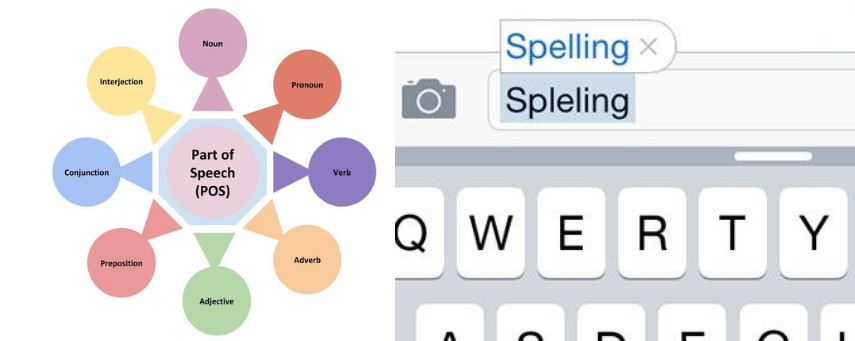
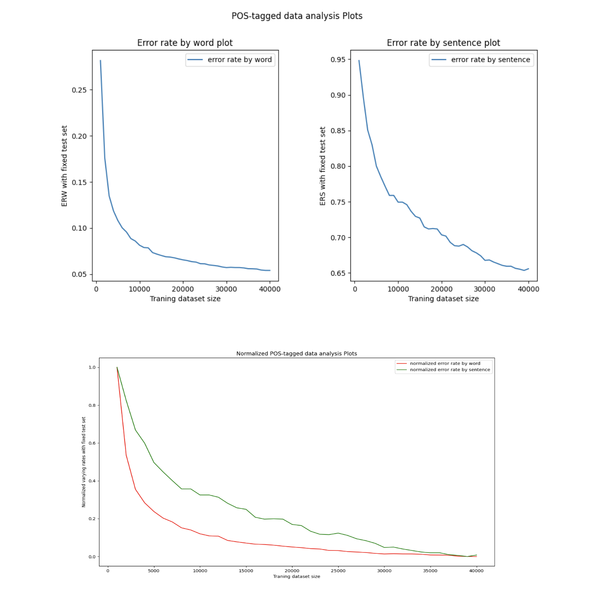

## Table of Contents

1. [Overview](#overview)
2. [Tech Stack](#tech-stack)
3. [Model Design](#model-design)
4. [Project Highlights](#project-highlights)
5. [Evaluation & Impact](#evaluation--impact)
6. [Applications](#applications)
7. [Future Scope](#future-scope)
8. [Links](#links)

---

## Overview

**NLP POS Tagging and Autocorrection** is a two-part project that investigates fundamental and advanced techniques in natural language processing. The work revolves around two core tasks: **Part-of-Speech (POS) tagging** and **spell correction**, both of which are crucial components in most NLP pipelines.

The goal of the project was to build models from scratch using both traditional probabilistic methods and modern deep learning architectures. Along the way, I focused heavily on performance comparisons, error analysis, and multilingual generalization, which allowed for a deep understanding of the capabilities and limitations of each approach.

---

## Tech Stack

- **Programming Languages:** Python  
- **Libraries:** NumPy, PyTorch  
- **Tools:** Matplotlib, Jupyter Notebooks

The entire project was developed using **Python** due to its strong support for scientific computing and machine learning. **NumPy** was used for core array operations and data transformations, while **PyTorch** powered the training of deep learning models. Visual analysis and debugging were done with **Matplotlib**, and the entire workflow  from preprocessing to evaluation  was managed in **Jupyter Notebooks**, making experiments easy to document, iterate, and reproduce.

---

## Model Design

For the POS tagging task, I began with **Hidden Markov Models (HMMs)** using both bigram and trigram sequences. These probabilistic models provided a strong baseline and helped in understanding language structure from a statistical perspective.

To go further, I implemented **Recurrent Neural Networks (RNNs)**, **Long Short-Term Memory (LSTM)** networks, and **Bidirectional LSTMs**. These models were trained on labeled corpora and evaluated on both accuracy and sentence-level correctness. The Bidirectional LSTM, unsurprisingly, performed best due to its ability to leverage both past and future context  essential in tagging ambiguous or complex sentence structures.

In parallel, the autocorrection component was based on **n-gram language models** (unigram, bigram, trigram), which were enhanced using **Laplace smoothing** and **backoff strategies**. These were used to detect and correct spelling mistakes by predicting the most probable word given its context.

---

## Project Highlights

A big focus of this project was **comparative evaluation**. I ran all models across several datasets and analyzed performance across different language types  including English, Japanese, and Bulgarian  to understand how morphology and sentence structure influence tagging accuracy and error rates.

I also visualized learning curves to diagnose underfitting, overfitting, and convergence speed for each model. The insights gained here helped optimize training regimes and model complexity. Performance results and plots were compiled to clearly present how traditional methods stack up against neural architectures  not just in accuracy, but also in training efficiency and robustness.

---

## Evaluation & Impact

The models were evaluated on **token-level accuracy**, **sentence-level correctness**, and **correction accuracy** (for the autocorrect task). What stood out was that neural models  particularly BiLSTMs  consistently outperformed HMMs in POS tagging, especially when dealing with longer sequences or noisy input.

From the autocorrection side, trigram models with smoothing performed significantly better than simpler methods, particularly in real-world typos and context-heavy sentences.

Beyond metrics, the project gave me a sharper understanding of how NLP models generalize across languages, and what kinds of patterns are hardest to learn  such as rare words, non-standard grammar, or homophones. The visualizations and result summaries were especially well-received in peer review and presentations.

---

## Applications

The techniques developed here have direct relevance in NLP systems like **grammar correction tools**, **chatbots**, and **language learning platforms**. Accurate POS tagging enhances syntactic parsing, which feeds into downstream tasks like named entity recognition and machine translation. Meanwhile, reliable spell correction is essential for user-facing applications that deal with raw text input, such as messaging platforms or browser extensions.

The multilingual focus also adds value for global deployment of NLP tools, where different languages present very different linguistic challenges.

---

## Future Scope

There’s a lot of room to build on this foundation. The next steps would be to:

- Extend POS tagging and autocorrection to more languages and dialects, especially those with low-resource datasets.
- Develop real-time spell correction capabilities that could integrate into editors or browsers.
- Implement **transformer-based models** like **BERT** or **RoBERTa**, which have shown state-of-the-art performance in many NLP benchmarks. These could offer significant improvements, particularly in edge cases where sequential models like LSTMs fall short.

---

## Links

[🔗 View Repository on GitHub](https://github.com/AnushaLavanuru5/POSTagging_AutoCorrection)
