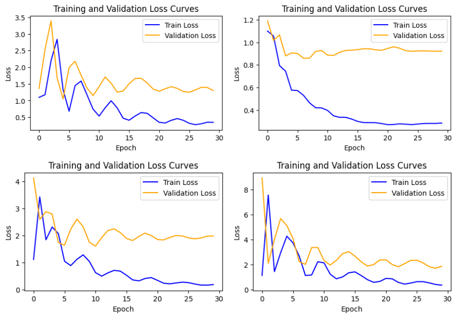

## Table of Contents

1. [Overview](#overview)
2. [Tech Stack](#tech-stack)
3. [Key Features](#key-features)
4. [Project Highlights](#project-highlights)
5. [Impact](#impact)
6. [Applications](#applications)
7. [Future Scope](#future-scope)
8. [Related Links](#related-links)

---

## Overview

The **Probing GPT-2 Layers for Understanding and Relationship Analysis** project explores the internal workings of GPT-2 using structural probing. The aim is to uncover how different layers of the transformer model understand linguistic relationships such as **entailment**, **contradiction**, and **neutrality**.

Probing in this context involves extracting hidden states from specific layers and analyzing their performance on relationship classification tasks. By examining how information is structured and interpreted across GPT-2's architecture, the project provides insights into the distribution of semantic understanding across the model's depth.

---

## Tech Stack

- **Programming Languages:** Python  
- **Libraries:** Transformers, Baukit, Scikit-learn  
- **Tools:** PyTorch, Google Colab

The project was developed in **Python**, utilizing the **Transformers** library for accessing GPT-2 internals. **Baukit** was used for model dissection and hidden state access, while **Scikit-learn** provided the necessary tools for probing and classification. The entire workflow was executed in **Google Colab**, taking advantage of its GPU environment and ease of visualization. **PyTorch** was the core framework powering both model interaction and training tasks.

---

## Key Features

This project presents a detailed **layer-by-layer probing analysis** of GPT-2. Hidden states from multiple points including shallow like `h.0.mlp`, intermediate like `h.3.mlp`, and deeper layers like `h.9.attn` were examined to assess how the model processes and builds semantic understanding.

One of the key focal points was **semantic relationship classification**. The system was tasked with identifying entailment, contradiction, and neutrality between sentence pairs, allowing a performance comparison across different GPT-2 layers.

Structural probing provided insights into **which layers contribute most** to tasks requiring nuanced understanding. The project explored both feed-forward and attention blocks to understand **layer interaction dynamics** and how contextual data flows through the model.

Performance was measured using quantitative metrics, enabling comparisons and highlighting which layers specialize in tasks such as **paraphrase detection**, **sentiment analysis**, or **logical inference**. Additionally, the findings demonstrated how some layers adapt more effectively to specific types of input, offering practical guidance for model interpretability in downstream applications.

---

## Project Highlights

A core highlight of this work was the layer-specific evaluation pipeline designed to operate seamlessly within Google Colab. The project successfully mapped the **semantic capabilities of different GPT-2 layers**, showing the increasing depth of understanding from shallow to deep representations.

Deeper layers, particularly those involving attention heads, were found to contribute most significantly to capturing linguistic relationships. The project’s clean architecture also made it easy to plug in additional datasets and models for comparative analysis.

---

## Impact

Through structural probing, the project **quantified the semantic gains** across layers, demonstrating that deeper layers improved performance in relationship classification tasks.

The work was recognized for its contribution to **model transparency**, making it easier to understand what GPT-2 “knows” and where that knowledge is concentrated. By identifying specific layers responsible for semantic interpretation, the project opens the door for better fine-tuning and transfer learning strategies.

---

## Applications

This project has multiple practical and academic applications. It supports **linguistic analysis** by shedding light on how transformer models internally encode meaning. It also acts as an **educational tool** for teaching the principles of probing, interpretability, and model internals.

For developers and researchers working with LLMs, this approach can be used for **model debugging**, helping pinpoint layer-level performance issues or inefficiencies during fine-tuning.

---

## Future Scope

There are several directions in which this work can expand. One of the next steps involves **multi-model probing**, extending the same evaluation to models like BERT, RoBERTa, and T5 to explore architectural differences in semantic encoding.

Additionally, future development may involve **predictive modeling**, **interactive visualizations**, and **real-time probing tools** to analyze layer behaviors during inference on live inputs.

---

## Related Links

- [SNLI Dataset](https://nlp.stanford.edu/projects/snli/)  
- [GenAI GitHub Repository](https://github.com/AnushaLavanuru5/ProbingGPT2)

---
